<!-- ✨ Animated Banner ✨ -->

---

<table>
<tr>
<td width="35%" align="center" valign="top">

</td>
<td width="65%" valign="top">

### ⚡ Core Focus & Architecture

| 🚀 Area | 🛠️ Technologies |
|:---|:---|
| 🏗️ **Backend** | `C#` · `ASP.NET Core` · `Clean Arch` |
| 🧠 **AI / ML** | `Python` · `PyTorch` · `TensorFlow` |
| 🗄️ **Data** | `SQL Server` · `MongoDB` · `Redis` |
| 🐳 **DevOps** | `Docker` · `CI/CD` · `Linux` |
| ⚡ **Performance** | `High Concurrency` · `Low Latency` |

 

> 💡 *"Discipline over motivation. Systems over shortcuts."*

 

</td>
</tr>
</table>

---

### 📊 Engineering Stats

&nbsp;&nbsp;

  

  

  

  

### 🐍 Contribution Snake

 

 

*⚡ If it can be optimized, automated, or made smarter — I'm in.* 🚀

